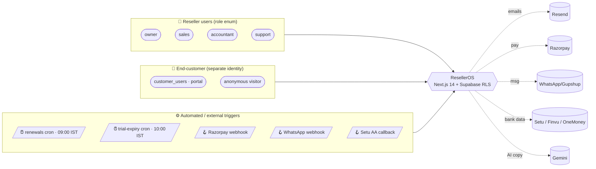
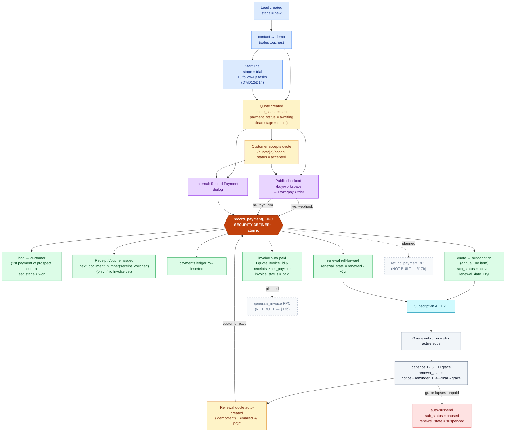
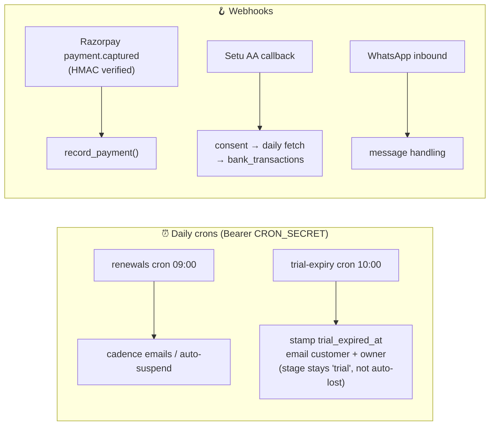

# ResellerOS V3 — Workflow Diagrams

> Deep-research output. Reconstructed from the **actual codebase** (`production/supabase/migrations/*` + `production/src/app/api/*`), not from the aspirational `WORKFLOWS-DETAILED.md`. Every node maps to real code; "planned / not built" items are drawn dashed.
>
> **What this app is:** a multi-tenant SaaS for Indian cloud resellers (Google Workspace / M365 / Zoho). One tenant = one reseller business; each tenant manages its own end-customers. Tenant isolation = `tenant_id` + RLS on every table (`0001_init.sql`, `0002_rls.sql`).

---

## 1. System context — actors & triggers



---

## 2. Master spine — Lead → Cash → Subscription → Renewal (the core loop)

This is the heart of the product. **Three different entry paths all converge on the `record_payment` RPC**, which is the single atomic handoff.



---

## 3. Trigger entry points (cron + webhooks)



---

## 4. Secondary / parallel flows

```mermaid
flowchart TD
    subgraph ACCT["💰 Accounting (0013–0015)"]
        A1["Invoices / Bills / Expenses"] --> A2["P&L · GST · Aging<br/>Profitability · SaaS metrics"]
        A1 --> A3["TDS receivable + year-end<br/>+ TDS cert storage"]
    end

    subgraph BANK["🏦 Banking + Account Aggregator (0048–0050)"]
        B1["AA consent: initiated→pending→active"] --> B2["daily FI fetch → bank_transactions"]
        B2 --> B3["suggest_bank_transaction_matches()<br/>→ reconcile vs payments/invoices"]
    end

    subgraph PART["🔗 Partner / reseller hierarchy (0040–0045)"]
        P1["Distributor tenant<br/>parent_tenant_id"] --> P2["Partner catalog shared to child"]
        P3["Invoice INSERT in parent"] -. "AFTER INSERT trigger" .-> P4["mirrored vendor_bill in child<br/>VB-PARTNER-* (idempotent)"]
        P1 --> P5["cross-tenant deal visibility + metrics"]
    end

    subgraph PORTAL["🌐 Customer portal (0016)"]
        C1["customer_users login"] --> C2["read-only: invoices · orders<br/>subscription · support · profile"]
    end

    subgraph MKTG["📣 Campaigns / WhatsApp"]
        M1["Campaign + AI-generate (Gemini)"] --> M2["send via email / WhatsApp"]
        M3["Contacts import (Google CSV)"] --> M4["promote → lead"]
    end

    classDef plannededge stroke-dasharray:5 5;
```



---

## 5. Status lifecycles (state machines)

```mermaid
stateDiagram-v2
    direction LR
    state "Lead (lead_stage)" as L {
        [*] --> new
        new --> contact --> demo
        demo --> trial
        demo --> quote
        trial --> quote
        quote --> won
        new --> lost
        contact --> lost
        demo --> lost
    }
    state "Quote (quote_status)" as Q {
        [*] --> draft
        draft --> sent
        sent --> viewed
        viewed --> accepted
        sent --> accepted
        sent --> rejected
        sent --> expired
    }
    state "Subscription renewal_state" as R {
        [*] --> pending
        pending --> notice_sent --> reminder_1 --> reminder_2
        reminder_2 --> reminder_3 --> reminder_4 --> final_sent
        final_sent --> grace_period
        grace_period --> renewed
        grace_period --> suspended
        renewed --> pending : next cycle
    }
```

---

## 6. Implemented ✅ vs Planned 🟡 (honest gaps)

| Area | Status | Evidence |
|---|---|---|
| Lead → quote → payment → customer → subscription | ✅ built | `record_payment` RPC `0006`, `0010`, `0012`, `0047` |
| Renewal cadence + auto-suspend + roll-forward | ✅ built | `0008`, `0010`, `cron/renewals/route.ts` |
| Public checkout (Razorpay live + simulation) | ✅ built | `api/public/checkout/workspace/route.ts` |
| Trial flow + trial-expiry cron | ✅ built | `0046`, `cron/trial-expiry/route.ts` |
| Cross-tenant invoice mirror (distributor→reseller) | ✅ built | `0043` AFTER INSERT trigger |
| Customer portal (read-only self-serve) | ✅ built | `0016` |
| Banking + Account Aggregator (Setu) | ✅ built | `0048`–`0050`, `lib/aa/setu.ts` |
| **`generate_invoice` RPC** (quote→invoice atomic) | 🟡 **NOT built** | CLAUDE.md §17b TBD; invoice created app-layer |
| **`refund_payment` RPC** | 🟡 **NOT built** | CLAUDE.md §17b TBD |
| Quote-accept → reseller notify email | 🟡 TODO | `public/quote/[id]/accept/route.ts:52` |
| Quote `viewed` status (open-tracking) | 🟡 enum exists, unwired | `0001_init.sql:140` |
| Zoho Books sync / Google CSP provisioning / support tickets | 🟡 doc-only | aspirational in `WORKFLOWS-DETAILED.md`, no code |
| Hindi i18n | 🟡 planned | English only shipped |

---

### Key files
`supabase/migrations/0001_init.sql` · `0006_record_payment_rpc.sql` · `0008_renewals_automation.sql` · `0010_renewal_rollforward.sql` · `0016_customer_portal_auth.sql` · `0040_reseller_hierarchy.sql` · `0043_cross_tenant_invoice_mirror.sql` · `0048_banking_module.sql` · `0050_bank_aa_connections.sql`
`src/app/api/cron/renewals/route.ts` · `cron/trial-expiry/route.ts` · `webhooks/razorpay/route.ts` · `public/checkout/workspace/route.ts` · `public/quote/[id]/accept/route.ts` · `leads/start-trial/route.ts`
